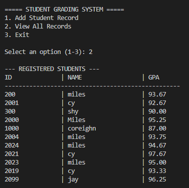

# Student Grading System
**Author:** Orap, Corinne Miles
**Section:** BSCS-1B

## Project Description
This is a Command Line Interface (CLI) application developed in Python to streamline the process of managing student records. It allows for the input of student details and grades, performs automatic GPA calculations, and ensures data persistence by saving all records to a JSON file.

## Features List
* **Object-Oriented Design:** Developed using `Student` and `GradeSystem` classes for better code organization.
* **Data Persistence:** Uses a JSON file to store data, so records aren't lost when the program closes.
* **Automatic GPA Calculation:** Built-in algorithm to compute the average of grades automatically.
* **Formatted Table View:** Uses advanced F-string alignment to display records in a professional, easy-to-read table.
* **Error Handling:** Validates inputs to ensure the program doesn't crash during data entry.

## Installation and Setup
1.  **Clone the Repository:**
    ```bash
    git clone [https://github.com/](https://github.com/)[milescors]/Orap_CorinneMiles_FinalProject.git
    ```
2.  **Navigate to the Source Directory:**
    ```bash
    cd Orap_CorinneMiles_FinalProject/src
    ```
3.  **Run the Application:**
    ```bash
    python main.py
    ```

## 🖥️ Sample CLI Usage
Below is a demonstration of the system in action:

### 1. Adding a New Student Records


### 2. Viewing Formatted Records



## 🎥 Video Demonstration
The detailed 10-15 minute walkthrough and code explanation can be found here:
[https://youtu.be/5fscHLPZV78]
